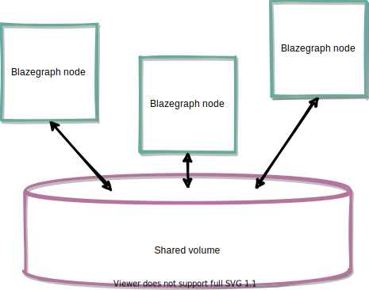

Blazegraph is a high performance scale-out triple-store for big data which can support up to ~12.7B triples in a single machine (see previous [post]() ). Even though it is presented as an ultra high-performance graph database and designed to scale-out, the scale-out feature has not been that much supported as developers would wish.

At the beginning (from the 2.0.0 release), the scale-out was moved to a Enterprise fueture under licence supriptions, as we can see from  the following information about High Availability (HA) and Scale-out features in the Blazegraph Blog (https://blog.blazegraph.com/):

> **Enterprise Features (HA and Scale-out)**
>
> Starting in release 2.0.0, the Scale-out and HA capabilities are moved to Enterprise features. These are available to uses with support and/or license subscription. If you are an existing GPLv2 user of these features, we have some easy ways to migrate. Contact us for more information. We’d like to make it as easy as possible.

Later, the support for High Availability was droped out from the project, due to the lack of open source community, as it is corroborated by Bryan Thompson (@thompsonbry), the Chief Scientist and founder of SYSTAP and one of the contributors of Blazegraph, in the issue #116 at Blazegraph/database GitHub (https://github.com/blazegraph/database/issues/116):

>The HA configuration is not functional in more recent releases. Systap halted development of the Blazegraph HA feature several years ago (long before we came to Amazon).  Full HA is a complex thing to develop and maintain with master failure, testing of the various failover configurations, longevity testing, targeted failure mode tests, etc.  We self-funded quite a bit, but we did not get the engagement from the open source community to make it worth while to continue HA as an open source feature.
>
>You can always do the poor man's HA, put the updates onto a durable queue, and then apply writes to each server in parallel.  You would need to handle master failover of course.  Or you can capture the IChangeLog from one server and replicate the post-facto changes (in terms of statements added and removed) to the other servers, again using a durable queue to capture the post-commit change set.  To do the latter, you would also need to report additions to the dictionary indices (which is not currently done, but which would not be that difficult to add in the LexiconRelation and an apply loop interface for the replicas to apply the deltas on their local indices).  I think this might "just work".  The local journal tracks the transactions in flight and manages the recycling of deleted records once no transaction can read on those records.  So transactional access to data should "work" on the replicas without doing anything else. Again, you would need to handle master failover, etc.
>
>Thanks, Bryan

Currently, since Blazegraph was taken over by Amazon (Neptune AWS), the project does not seem to be activly maintained. However, it is possible to scale-out Blazegraph and configure with HA clusters. 

The Blazegraph scale-out architecture (Figure 1) is based 
on a shared disk volume where all Blazegraph's nodes have access to the data. This shared disck volume can be set-up accross different machines, racks or regions with servies like Gluster. A load balancer distributes the data requests and updates between the Blazegraph's nodes and Zookeeper manages the services running on each node.



The Blazegraph scale-out architecture provides with horisontal scaling as both nodes an disks space can be extended. However, this architecture does not provide of distributed data along each node, as it would be the case of Apache Cassandra. 

Due to the lack of documentation and support for clustered and HA Blazegraph deployment, the scale-out option is only for those fearless adventurers who wants to try out the clustered and HA version of Blazegraph. A guide about how to deploy the clustered configuration can be found at https://github.com/blazegraph/database/wiki/ClusterGuide with the following advice: `We recommend that you ask for help when attempting your first cluster install!`, the HA configuration is explained at https://github.com/blazegraph/database/wiki/HAJournalServer#Basic_Deployment, and a example with the Wikidata deployment of Blazegraph can be found at https://wikitech.wikimedia.org/wiki/Nova_Resource:Wikidata-query/Documentation (the author of this post doesn't take responsabilities for your failed attempts or disasters -- if you success, I will like to hear and lear how you have manage it :smile:).

{}
Still, the stand-alone version Blazegraph is a really interesting option for working with an open source triple-store which can manage big data volumes while providing high performance and support for RDF, SPARQL 1.1 and Gremlin.
{}

